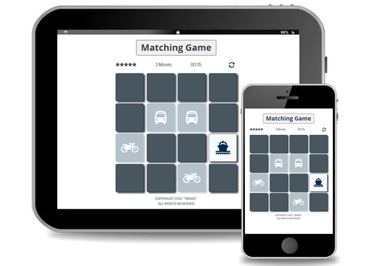

# Memory Game about Means of Transport
[Demo](https://tbm85.github.io/Demo-Memory-Game/)

## Description
This memory game is a customization of the design model provided by Udacity to carry out this second project. It is a responsive web design built with HTML, CSS and Javacript.

## Resources
* [Udacity Template](https://github.com/udacity/fend-project-memory-game/)
* [Font Awesome Icons](https://fontawesome.com/v4.7.0/icons/)
* [Coda Font](https://fonts.googleapis.com/css?family=Coda)

## Objective
Match the eight pairs of hidden cards, with the highest rating in stars and in the shortest possible time.

## Instructions
* Turn a first card to reveal its symbol and then turn a second card
* If the symbol of both cards matches, they remain visible
* If the symbol of both cards does not match, they are hidden again
* The game ends when all the cards have been matched or when the 30 moves are exceeded
* The player wins when all the cards have been matched
* The player loses when he does not finish matching the cards before the 30 moves

## License
Copyright (c) 2018 Tania Ballester Marsal. This project is using [MIT License](LICENSE.md)
